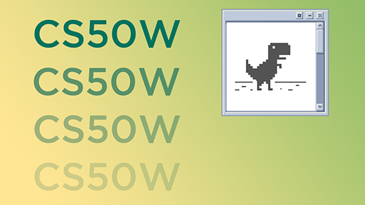
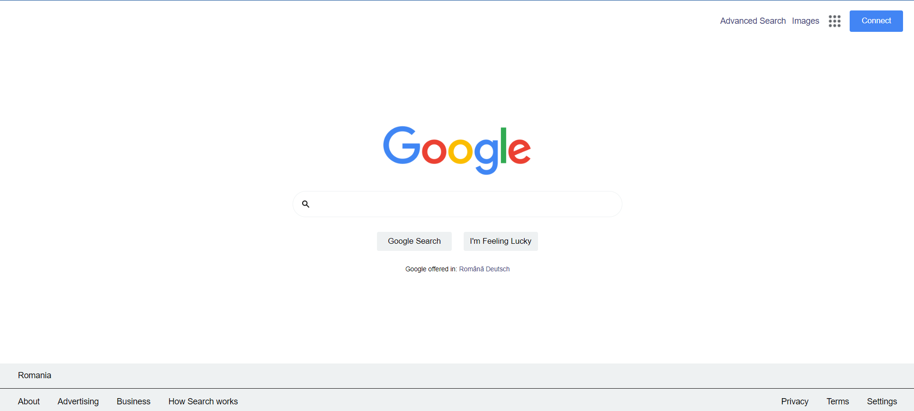
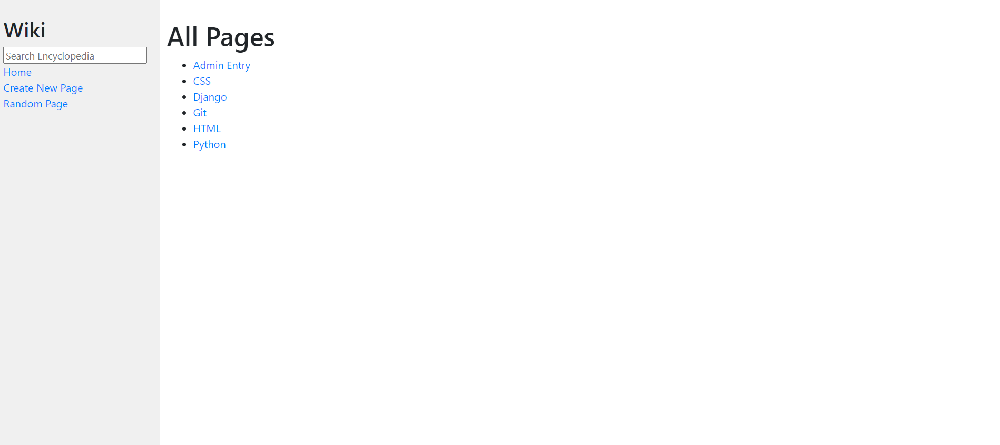
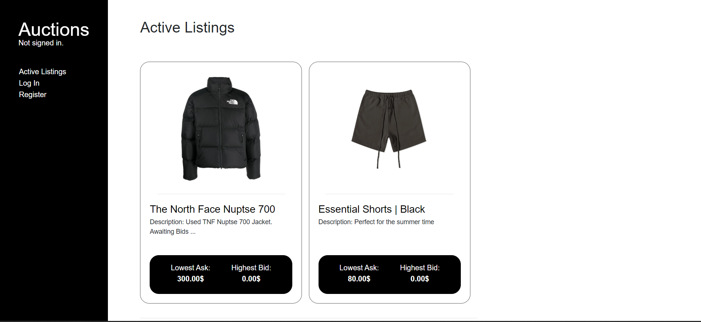
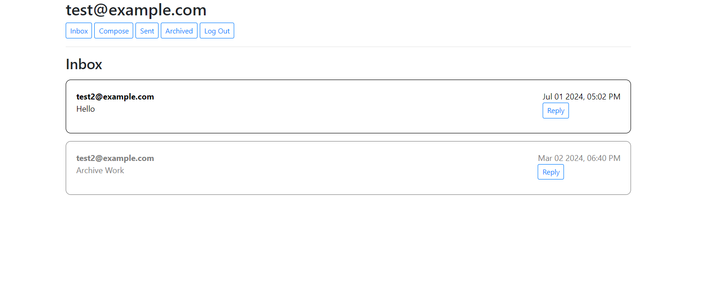
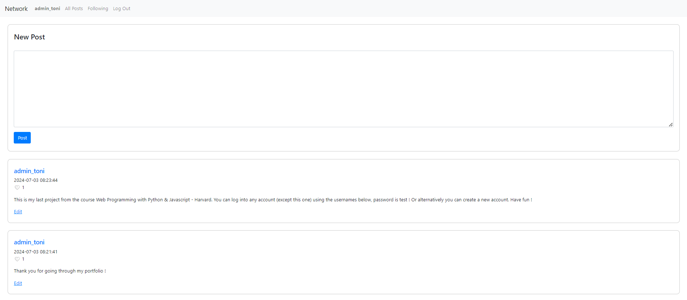

# Web Programming
  
For more details on the course contents check the [Official Course Page](https://cs50.harvard.edu/web/2020/).

## Overview
The Web Programming Repository contains the projects made following Harvard's CS50 Web Programming with Python and JavaScript Course.  
 
## Table of Contents
- [Prerequisites](#prerequisites)
- [Installation](#installation)
- [Projects Table](#project-table)
- [Technologies Used](#technologies-used)
- [License](#license)

## Prerequisites
Before running the apps on your system, ensure you have the following:

1. **Python**: Ensure you have Python installed on your system. You can download it from [Python's official website](https://www.python.org/downloads/).
    - **Linux**: Install Python using your package manager. For example, on Ubuntu:
        ```sh
        sudo apt-get update
        sudo apt-get install python3
        ```
    - **macOS**: Install Python via Homebrew:
        ```sh
        brew install python
        ```
    - **Windows**: Download and install Python from [Python for Windows](https://www.python.org/downloads/windows/).

2. **Django**: A high-level Python web framework that encourages rapid development and clean, pragmatic design. You can install Django using pip:
    - Open a terminal or command prompt.
    - Execute the following command:
        ```sh
        pip install django
        ```
3. **Git**: A version control system to clone the repository. To install Git:
    - **Linux**: Install Git using your package manager. For example, on Ubuntu:
        ```sh
        sudo apt-get update
        sudo apt-get install git
        ```
    - **macOS**: Install Git via Homebrew:
        ```sh
        brew install git
        ```
    - **Windows**: Download and install Git from [Git for Windows](https://gitforwindows.org/).

4. **Internet Connection**: Required to download the repository and Docker images.

## Installation
To run the apps locally, follow these steps:

1. Clone the repository:
    ```sh
    git clone https://github.com/antonio-hus/Web-Programming.git
    cd Web-Programming/PROJECT_NAME
    ```

2. Start the Django Applications:
    ```sh
    # Navigate to folder that contains manage.py and run:
    python manage.py runserver
    ```

## Projects Table
You can view more in-app images in the Images folder:  
  
1. **Search**:
Task: Design a front-end for Google Search, Google Image Search, and Google Advanced Search.
   
  
2. **Wiki**:  
Task: Design a Wikipedia-like online encyclopedia.

  
3. **Auctions**:  
Task: Design an eBay-like e-commerce auction site that will allow users to post auction listings, place bids on listings, comment on those listings, and add listings to a “watchlist.”

     
4. **Mail**:  
Task: Design a front-end for an email client that makes API calls to send and receive emails.

  
5. **Social Network**:  
Task: Design a Twitter-like social network website for making posts and following users.


## Technologies Used
- **Django**: Backend Framework used to develop the backend of the applications.
- **Python**: Used in pair with Django Framework.
- **JavaScript**, **HTML**, **CSS**, **Bootstrap**: Used to develop the front-ends of the applications

## License
The projects are developed following the CS50's Web Programming with Python and Javascript Course lab requirments and thus fall under Harvard's license - [License Page](https://cs50.harvard.edu/web/2020/license/).  
